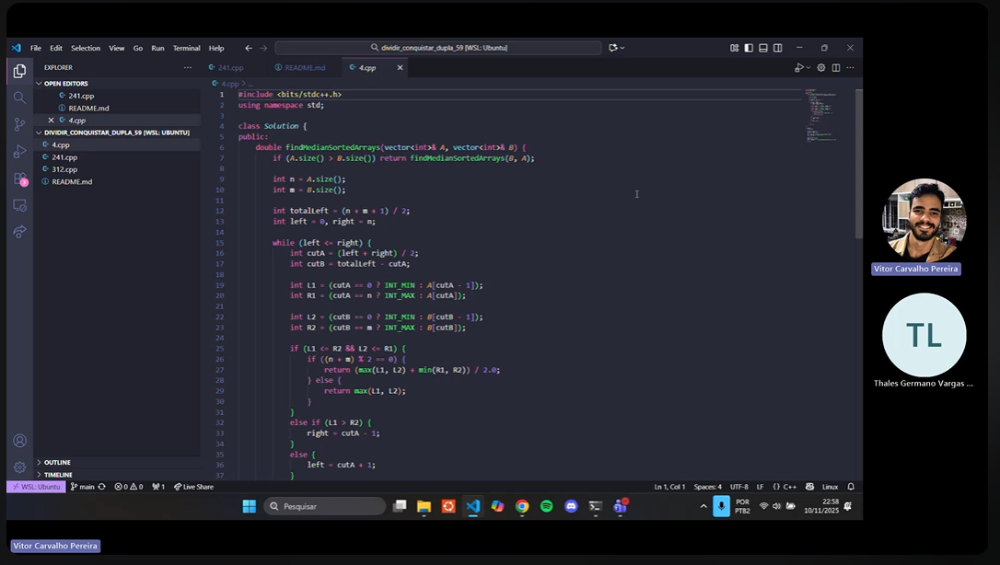

#  Dividir e Conquistar

**Número da Lista**: 4  
**Conteúdo da Disciplina**: FGA0124 - PROJETO DE ALGORITMOS  

## Alunos

<div align = "center">
<table>
  <tr>
    <td align="center"><a href="https://github.com/thalesgvl"><br /><sub><b>Thales Germano Vargas Lima</b></sub></a></td>
    <td align="center"><a href="https://github.com/vcpVitor"><br /><sub><b>Vitor Carvalho Pereira</b></sub></a></td>
  </tr>
</table>

| Matrícula       | Aluno              |
| --------------- | ------------------ |
| 20/2017147 | Thales Germano Vargas Lima |
| 21/1062615 | Vitor Carvalho Pereira |
</div>

## Sobre 
A atividade foi baseada na resolução de desafios de programação da plataforma LeetCode.  
Foram selecionados **3 exercícios** focados em **Dividir & Conquistar (Divide and Conquer)**, cobrindo estratégias clássicas: busca binária em partições, DP intervalar e divisão recursiva de expressões.

## Exercícios 

---

### [4. Median of Two Sorted Arrays](https://leetcode.com/problems/median-of-two-sorted-arrays/) – Hard  

Dadas duas listas ordenadas `nums1` e `nums2`, encontrar a **mediana** em `O(log(m+n))`.

**Ideia**

- Realizar **busca binária** na menor lista para encontrar uma **partição válida** que separe os elementos à esquerda/à direita das duas listas.  
- Condição de partição: `L1 <= R2` e `L2 <= R1`.  
- Mediana = `max(L1,L2)` (total ímpar) ou `(max(L1,L2)+min(R1,R2))/2` (total par).


---

### [312. Burst Balloons](https://leetcode.com/problems/burst-balloons/) – Hard  

Escolher a **ordem de estouro** de balões que maximiza as moedas.  
Ao estourar o balão `i` como **último** no intervalo `(l, r)`:  
`ganho = nums[l] * nums[i] * nums[r] + dp[l][i] + dp[i][r]`

**Ideia**

- Inserir sentinelas: `nums = [1, original..., 1]`.  
- **DP intervalar**: `dp[l][r]` = máximo no intervalo aberto `(l, r)`.  
- Transição: testar cada `k` como último do intervalo.


---

### [241. Different Ways to Add Parentheses](https://leetcode.com/problems/different-ways-to-add-parentheses/) – Medium  

Dada uma expressão com `+ - *`, retornar **todas as possíveis respostas** ao parentetizar de maneiras diferentes.

**Ideia**

- **Dividir e Conquistar**: para cada operador, resolver recursivamente esquerda e direita, depois **combinar** todos os pares.  
- **Memoização** por substring evita recomputações.


---

## Como executar localmente (C++)

### 4. Median of Two Sorted Arrays
- Arquivo sugerido: `median_two_arrays.cpp`  
- Compilar:  
  ```bash
  g++ -O2 -std=c++17 -o median median_two_arrays.cpp
  ```
- Execução (exemplo simplificado – adapte conforme seu main):  
  ```bash
  ./median
  ```

### 312. Burst Balloons
- Arquivo: `burst_balloons.cpp` (fornecido anteriormente)  
- Compilar:  
  ```bash
  g++ -O2 -std=c++17 -o burst_balloons burst_balloons.cpp
  ```
- Rodar (exemplos):  
  ```bash
  ./burst_balloons <<EOF
  4
  3 1 5 8
  EOF
  # ou
  echo "[3,1,5,8]" | ./burst_balloons
  ```

### 241. Different Ways to Add Parentheses
- Arquivo: `different_ways.cpp` (fornecido anteriormente)  
- Compilar:  
  ```bash
  g++ -O2 -std=c++17 -o different_ways different_ways.cpp
  ```
- Rodar (exemplos):  
  ```bash
  echo "2-1-1" | ./different_ways
  echo "2*3-4*5" | ./different_ways
  ```

---

## Apresentação 

<div align="center">
<a href="<<< LINK DO VÍDEO >>>"></a>

<font size="3"><p style="text-align: center">Autores: <a href="https://github.com/thalesgvl">Thales Germano Vargas Lima</a> & <a href="https://github.com/vcpVitor">Vitor Carvalho Pereira</a></p></font>
</div>
